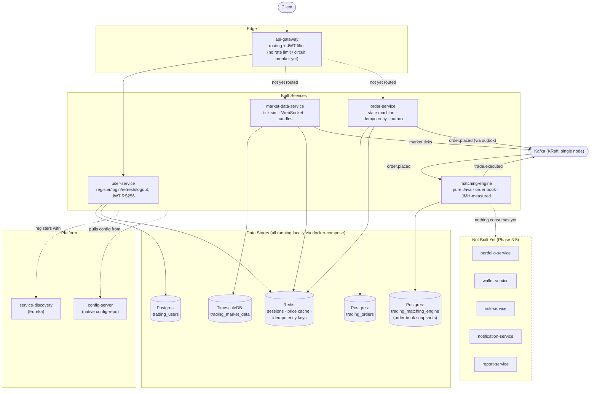

# Current-State Architecture

What's actually built and verified as of **Step 16** (see `dev-journal/CHECKPOINT.md`
for the authoritative step-by-step status). Compare against
`../target-state/architecture.md` for the gap.

## What's real vs. simulated right now

- **market.ticks** are synthetic (random walk), not a real market feed — by
  design, per CLAUDE.md.
- **trade.executed** is published by matching-engine but **nothing consumes
  it yet** — portfolio-service and wallet-service (Step 17+) are the intended
  consumers.
- **matching-engine has no idempotent-consumer dedup** on replayed
  `order.placed` events yet — a known gap, documented in
  `dev-journal/steps/step16-matching-engine.md`.
- **api-gateway routes only to user-service today** — market-data-service and
  order-service aren't yet reachable through the gateway (verified directly
  against their own ports in dev-journal steps 14/15).
