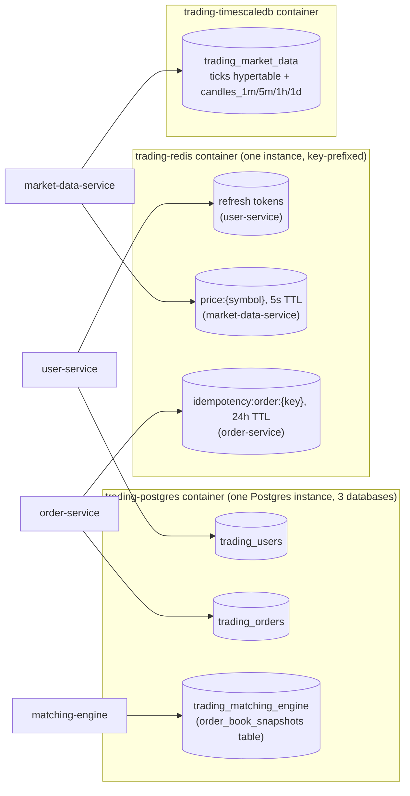

# Current-State Data Store Ownership

All infrastructure runs via `infrastructure/docker-compose.yml` on a single
host — no clustering, no read replicas, no sharding yet (all target-state
concerns, see `../target-state/data-stores.md`).

## Notes

- **One Postgres container, three databases** (`trading_users`,
  `trading_orders`, `trading_matching_engine`) — each service still owns its
  own database exclusively (no cross-database queries), just sharing one
  physical container for local-dev simplicity. `infrastructure/postgres-init/`
  has the init scripts that create the second and third databases on a fresh
  volume.
- **One Redis instance, key-namespaced per service** (`price:`, `idempotency:order:`,
  plus user-service's refresh-token keys) rather than separate Redis
  containers per service — again a local-dev simplification, not a
  target-state pattern.
- **matching-engine's snapshot table** (`order_book_snapshots`) doesn't exist
  in the target-state data-store table at all — it's specific to the
  recovery mechanism described in CLAUDE.md's matching-engine section
  ("periodic order-book snapshot persisted to DB for recovery"), not a
  business data store.
- No Elasticsearch yet (report-service, Phase 4, not built).
