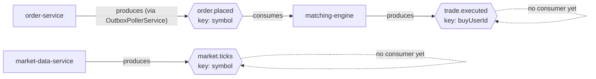

# Current-State Kafka Topic Flow

Only 2 of the 5 topics in `CLAUDE.md`'s Kafka Topics table are live today.

## Status vs. target state

| Topic | Producer | Consumer(s) today | Status |
|---|---|---|---|
| `market.ticks` | market-data-service | *(none)* | Produced, unconsumed. risk-service (target) doesn't exist yet. |
| `order.placed` | order-service (outbox) | matching-engine | **Fully wired and verified** (Step 15/16) |
| `trade.executed` | matching-engine | *(none)* | Produced, unconsumed. portfolio/wallet/notification (target) don't exist yet. |
| `order.updated` | *(not implemented)* | — | matching-engine doesn't publish this yet |
| `notification.events` | *(not implemented)* | — | notification-service doesn't exist yet |

## Verified delivery-semantics behavior (not just designed — actually tested)

- **order.placed survives a Kafka outage**: Step 15's journal documents
  stopping the `trading_kafka` container, placing an order, confirming the
  DB commit still succeeds, restarting Kafka, and confirming the outbox
  poller catches up within one poll cycle.
- **matching-engine does NOT yet dedup on `orderId`** — a replayed
  `order.placed` (the real possibility the above resilience creates) would be
  matched twice today. Documented as a known gap in Step 16's journal, not
  silently ignored.
