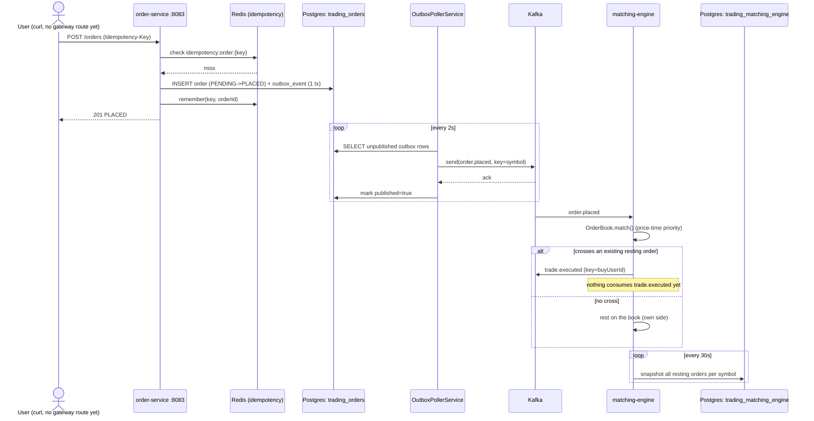

# Current-State Order Lifecycle (Sequence)

The actual path a `POST /api/v1/orders` request takes today, verified live in
Steps 15 and 16 (both diagrams' journal entries record the real commands run
and their output). This is where `../target-state/order-lifecycle-sequence.md`
currently stops — everything after `trade.executed` in the target diagram
doesn't exist yet.

## What was actually verified (not just implemented)

1. Idempotent replay — repeating the identical request with the same
   `Idempotency-Key` returns the same order, confirmed no duplicate row.
2. Kafka-down resilience — order + outbox row both commit even with
   `trading_kafka` stopped; poller catches up once it's back.
3. Two crossing orders published straight to Kafka (bypassing order-service)
   produced exactly one `trade.executed` with correct quantity/price/user ids.
4. Snapshot round-trip — restarting matching-engine after it had snapshotted
   correctly restored the order book state ("Restored 1 order book(s) from
   snapshot" in the actual log).

## Gaps vs. target-state

- No `api-gateway` route to `order-service` yet — tested directly against
  port 8083.
- No pre-trade risk check (risk-service doesn't exist).
- No `order.updated` published on fill — order-service's own DB row shows
  `PLACED`, not `FILLED`, since nothing currently tells it the order matched.
- Nothing settles the trade (no wallet debit/credit, no portfolio holdings
  update, no notification) — `trade.executed` is a dead end today.
