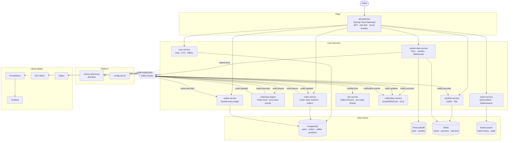

# Target-State Architecture

The full system as scoped in `CLAUDE.md`, all 5 phases complete. This is the
end goal, not the current state — see `../current-state/architecture.md` for
what's actually built.

## Key patterns this diagram implies

| Pattern | Where |
|---|---|
| Saga (choreography) | Order placement → fund freeze (wallet) → match (matching-engine) → settle (portfolio/wallet), all via Kafka events, no direct service-to-service calls in the happy path |
| Outbox | order-service → Kafka, guaranteed delivery |
| CQRS | portfolio-service: write side event-driven, read side materialized in Redis |
| Circuit breaker / bulkhead | Gateway and order-service, via Resilience4j |
| Dead letter queue | Every Kafka consumer service |

See `../target-state/kafka-topics.md` for the topic-level detail behind the
Kafka arrows above, and `../target-state/order-lifecycle-sequence.md` for the
full request-to-settlement flow through this diagram.
