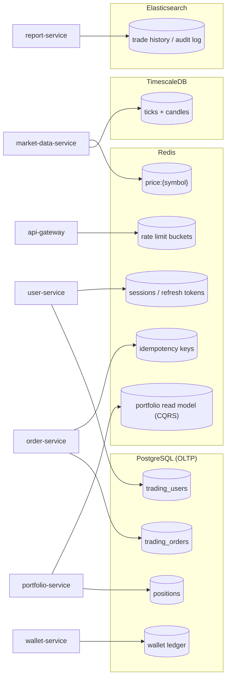

# Target-State Data Store Ownership

Which service owns which store, per `CLAUDE.md`'s Database Strategy table.
Each service owns its own schema/database — no service reaches into another
service's tables directly; cross-service data only travels via Kafka events.

## Notes

- **Shard `orders` by `user_id % N`** for horizontal scale — not reflected as
  a separate box here since it's a partitioning strategy within `OrdersDB`,
  not a separate store.
- **Read replicas** for portfolio/report read queries — same reasoning,
  an operational detail on top of the stores shown, not a new store.
- Portfolio-service's Redis usage is two-level: **Caffeine (L1, in-process,
  30s)** in front of **Redis (L2, 5min)** — Caffeine isn't drawn since it's
  process-local, not a shared store.
