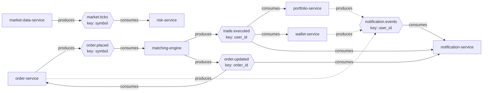

# Target-State Kafka Topic Flow

Every topic from `CLAUDE.md`'s Kafka Topics table, producer → topic →
consumer(s), with the partition key that determines ordering guarantees.

## Delivery semantics

- **At-least-once + idempotent consumers**, not exactly-once, is the honest
  framing throughout — see the outbox pattern note below. The one exception
  called out in CLAUDE.md is trade settlement, which uses Kafka transactions
  for exactly-once.
- Every consumer has a **Dead Letter Queue** for unprocessable messages
  (poison pills, schema mismatches).
- `order.placed` is published via the **Outbox pattern** from order-service —
  the DB write and the Kafka publish are never in the same atomic operation,
  so delivery is at-least-once by construction. Consumers (matching-engine)
  must dedup on `orderId`.
