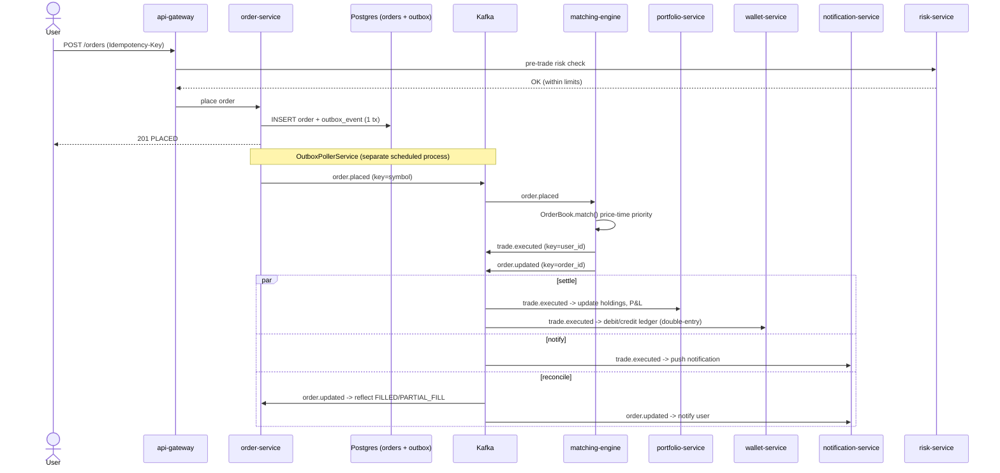

# Target-State Order Lifecycle (Sequence)

The full request-to-settlement path for one order, end to end, once every
service in `CLAUDE.md` exists.

## Notes

- The risk check on placement is a **synchronous pre-trade check**
  (position limits, margin) — everything after the order is placed is
  **asynchronous, choreographed via Kafka** (a Saga, not an orchestrator).
- Wallet fund freeze on placement / release on cancel-or-expiry isn't drawn
  here to keep the diagram readable — it hangs off the same `order.placed` /
  `order.updated` events, consumed by wallet-service.
- See `../current-state/order-lifecycle-sequence.md` for how much of this
  path is actually wired up and verified today.
